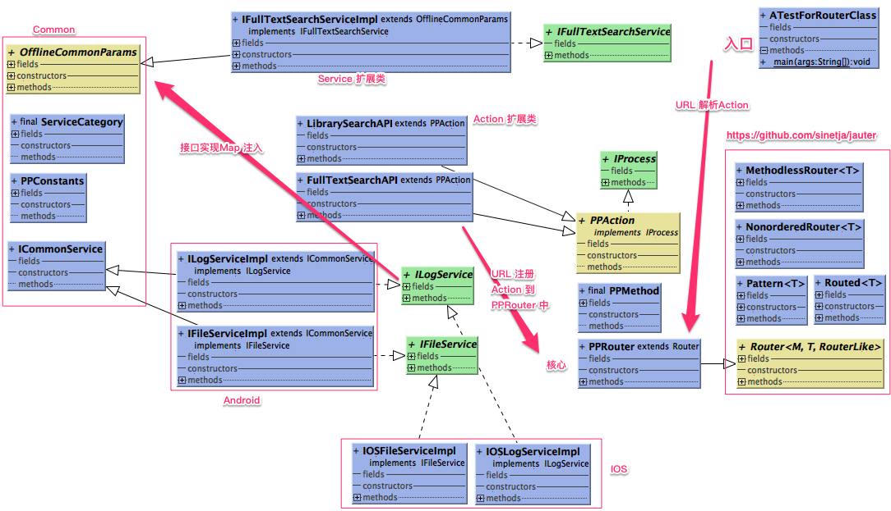

https://github.com/sinetja/jauter

1. 方便统一入口： 由URL解析到Action
2. 项目在J2objc中 调用使用可以 完美提升代码重复利用率 90%+
3. 后续扩展 只需要调整 Action注册，Service， Dao实现就好



```
PPRouter 注册
public void createPPActionFactory() {
    this.GET(IFullTextSearchServiceImpl.FULLTEXT_SEARCH_INIT, FullTextSearchAPI.class);
}
```

```
public class IFullTextSearchServiceImpl extends OfflineCommonParams implements IFullTextSearchService {
public static final String FULLTEXT_SEARCH_INIT = "ftsSearch/init/:libraryID";
```

```
public static void main(String[] args) throws Exception {
  JsonParser parser = new JsonParser();
  String paramStr = "{\"url\": \"ftsSearch/init/123\",\"method\":\"GET\"}";
  JsonObject requestObject = parser.parse(paramStr).getAsJsonObject();
  String path = requestObject.get(PPConstants.HTTP_REQ_URL).getAsString();
  String method = requestObject.get(PPConstants.HTTP_REQ_METHOD).getAsString();
  PPMethod temp = PPMethod.valueOf(method.toUpperCase());

  PPRouter router = new PPRouter();
  router.createPPActionFactory();
  Routed routed = router.route(temp, path);
  PPAction action = (PPAction) routed.instanceFromTarget();

  Map<ServiceCategory, ICommonService> commonServices = new HashMap<>();
  commonServices.put(ServiceCategory.LOG_SERVICE, new ILogServiceImpl());
  System.out.println(
      action.Process(requestObject, "dataBaseName", new File("path"), "unZippedPath", routed.params(), commonServices));
}
```
